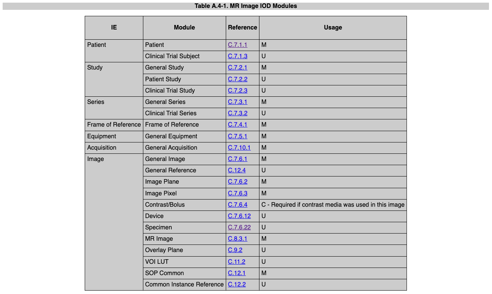

# Modules

These files generate attributes for different DICOM Information Object Definitions (IOD) Modules. Modules are the 
building blocks of [Composite IODs](https://dicom.nema.org/medical/Dicom/current/output/chtml/part03/chapter_A.html),
such as: 
- [CT Image IOD](https://dicom.nema.org/medical/Dicom/current/output/chtml/part03/sect_A.3.3.html)
- [MR Image IOD](https://dicom.nema.org/medical/Dicom/current/output/chtml/part03/sect_A.4.3.html)
- [Enhanced MR Image IOD](https://dicom.nema.org/medical/Dicom/current/output/chtml/part03/sect_A.36.2.3.html)
- [Secondary Capture IOD](https://dicom.nema.org/medical/Dicom/current/output/chtml/part03/sect_A.8.html#sect_A.8.1.3)

## Module Tables

The NEMA DICOM standard contains IOD Module Tables which define the Modules belonging to the different Composite IOD 
types. Below is the Module Table for the MR Image IOD:

These can be viewed interactively with the 
[Innolitics DICOM Standard Browser](https://dicom.innolitics.com/ciods/mr-image).

The files in this `modules` directory generate key DICOM attributes associated with the corresponding Module, e.g. 
`general_study.py` creates the attributes for the 
[General Study Module](https://dicom.innolitics.com/ciods/mr-image/general-study).

> **_Important Note/Reminder:_** Some Modules listed in the Table above have yet to be implemented in nii2dcm – such as 
'Contrast/Bolus', 'Overplay Plane' and various others – because they are currently surplus to my requirements. Further modules can 
easily be created by adding them to this `modules` directory. 